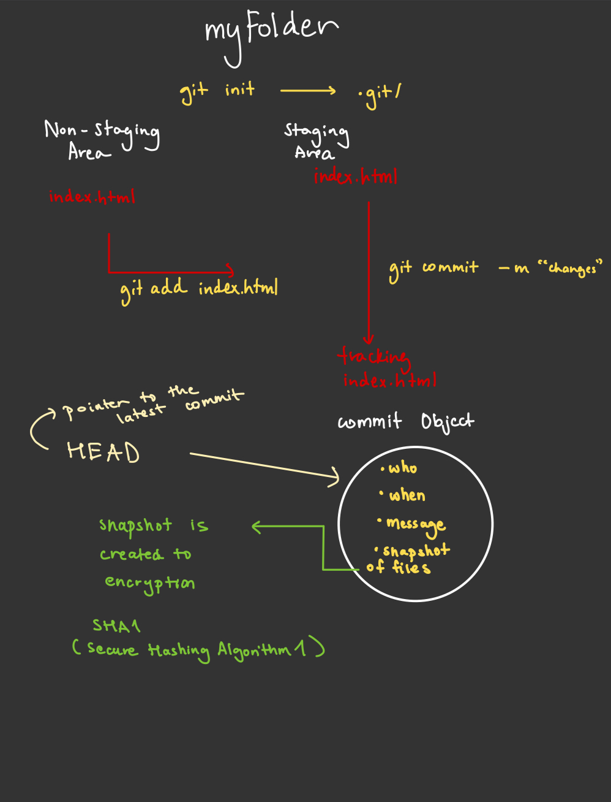

# Git Dive Deep

## git init

- default branch created while using git init is the master branch.
- When we initialize the repo, two regions are created.
- **Staging area** (where changes are prepared before commit)
- **Non-staging area** (working directory with untracked/modified files)

The `.git` directory contains:

- HEAD file (references current branch)
- config file (repository configuration)
- objects directory (stores all content)
- refs directory (stores pointers to commits)

### Remove a local git repo

```bash
rm -rf .git/
```

This deletes the repository history.

### Rename default branch name

```bash
git init --initial-branch=main
```

Sets initial branch to main instead of master.

Nested git repository.
Never create a git repo inside a repo.
Avoid this to avoid chaos.

Never create a git repo inside another repo (except for submodules)

Potential issues:

- Conflicting .git directories

- Confusing version control boundaries

- Complex merge behaviors

---

## git add

### Core Functionality

Stages changes from working directory to staging area

### Advanced Usage

Add a part of file to the staged area.

#### Interactive add (choose hunks)

```bash
git add -p
```

#### Add all tracked files (not new files)

```bash
git add -u
```

#### Add all tracked and untracked files

```bash
git add -A
```

```bash
# Add by file pattern
git add '*.js'
```

### Behind the Scenes

- Creates SHA-1 hashes of file contents
- Stores compressed versions in object database
- Updates index file with new file modes and hashes

---

## git commit

### Commit Anatomy

Creates a commit object containing:

- Author info
- Commit message
- Pointer to tree object (snapshot of repo)
- Pointer to parent commit(s)

### Advanced Options

```bash
# Amend previous commit
git commit --amend

# Amend previous commit with no commit message
git commit --amend --no-edit

# Sign commit cryptographically
git commit -S

# Commit with multiline message
git commit -m "Title" -m "Description"

# Commit with no changes (run pipeline)
git commit --allow-empty -m "dummy"

```

### Technical Details

- Each commit has a unique SHA-1 hash
- Commit objects reference tree objects
- Tree objects reference blob objects (files) and other trees

---

## git push

### Advanced Techniques

```bash
# Push specific branch
git push origin branch-name

# Set upstream branch
git push -u origin branch-name

# Force push (use with caution)
git push --force
```

### Protocols and Internals

- Can use HTTPS, SSH, or Git protocol
- Underlying transfer uses packfiles for efficiency
- Uses the "smart" protocol for modern servers

### Push Rejection Scenarios

1. **Non-fast-forward**: Remote has commits you don't have locally
   - Solution: `git pull` first to merge changes
2. **Permission denied**: Authentication issues
   - Solution: Check SSH keys or credentials
3. **Shallow update not allowed**: Pushing from shallow clone
   - Solution: Perform full clone

## git log

Gives last 2 commits

```bash
git log -n 2
```

```bash
git log --pretty= short
```

```bash
git log --pretty= full
```

## Summary

- Head is the pointer to the latest commit.
- You can change head.
- Every next commit points to the previous commit. It creates a linked list of commits.


