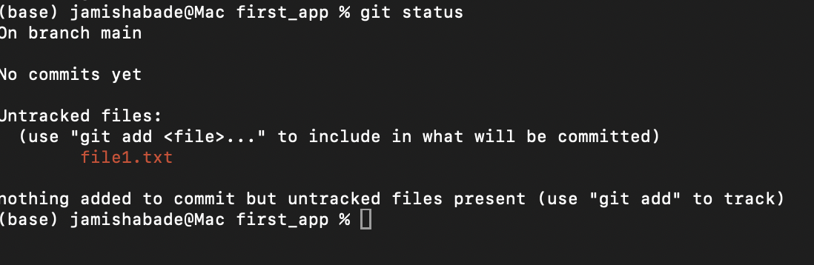
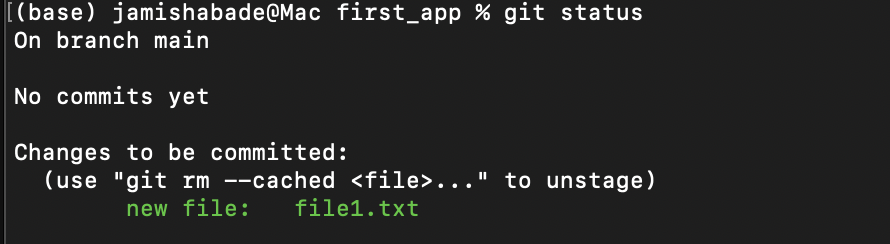

# Git Introduction

## What is Git?

Git is a distributed version control system. It helps to track changes in files, typically source code. It allows to collaborate with group of people without overwriting eachother's work.

## Git Installation

### On macOS

Git comes bundled with the **Command Line Tools for Xcode**. To check if it’s installed, open Terminal and type:

```bash
git --version
```

or

```bash
git -v
```

## Setting Personal Info to Git

Git requires you to set your name and email before you start committing changes. This information is stored in your commits.

```bash
git config --global user.name "yourusername"
```

```bash
git config --global user.email "youremail@example.com"
```

## Basic Commands

follow along step by step:

1. Create a folder/ directory called `git_module`

```bash
mkdir git_module
cd git_module
```

2. Create a subfolder called `first_app`

```bash
mkdir first_app
cd first_app
```

3. list files in the directory

```bash
  ls -l
```

4. Create a new file in the directory.

```bash
 nano file1.txt
```

6. In the text editor, write some texts 7. `Ctrl+X` and press Y

7. Initialize your git repository

```bash
git init
```

---

By this step, you have succesfully initialized a git repo

## Spoonfeed git changes

Git doesn’t automatically track changes in your files. You need to tell Git when a file is added, modified, or deleted.

Files that Git doesn’t know about are called untracked files.

Untracked files aren’t included in commits, and Git won’t keep a history of them until you explicitly add them.

If an untracked file is deleted before being added, Git cannot recover it.

Tip: Always use git status to see which files are untracked, modified, or staged for commit.

### Untracked files are in red:



## Adding git files

This is adding untracked files.

```bash
git add filename.txt
```

**_Here, the files are transformed from unstaging areas to staging area._**

If you have mutilple untracked files, then you can track it all at once.

```bash
git add .
```

## Git Status

To check the status of git:

```bash
git status
```



<span style="color:green">Files that Git already knows about. If changes are staged for commit, they appear in green..</span> </br>
<span style="color:red">New files Git doesn’t know about yet. These appear in red.</span>

## commit changes

Commits the staged changes to the repository.
It basically snapshots your repo at a specific point. In other words, it is recording the changes in the repo.

```bash
git commit
```

This opens a text editor to type your commit.

1. Press I to enable Insert.
2. Type your commit message.
3. Press Escape key.
4. type `:wq` and press Enter.

---

If you are smart then just do: (Quick Commit)

```bash
git commit -m "your commit message"
```

## commit history

View your commit history.

```bash
git log
```

This will display commit hash, Author, Date and Commit message.

## Summary

1. Create a local repo: `git init`

2. When we create a new file in the repo, git is unaware of it.
3. `git add filename.extension`
4. Now git is in staging area and git is aware of the file.
5. `git commit -m "commit message"`
6. `git status`
7. `git log`
