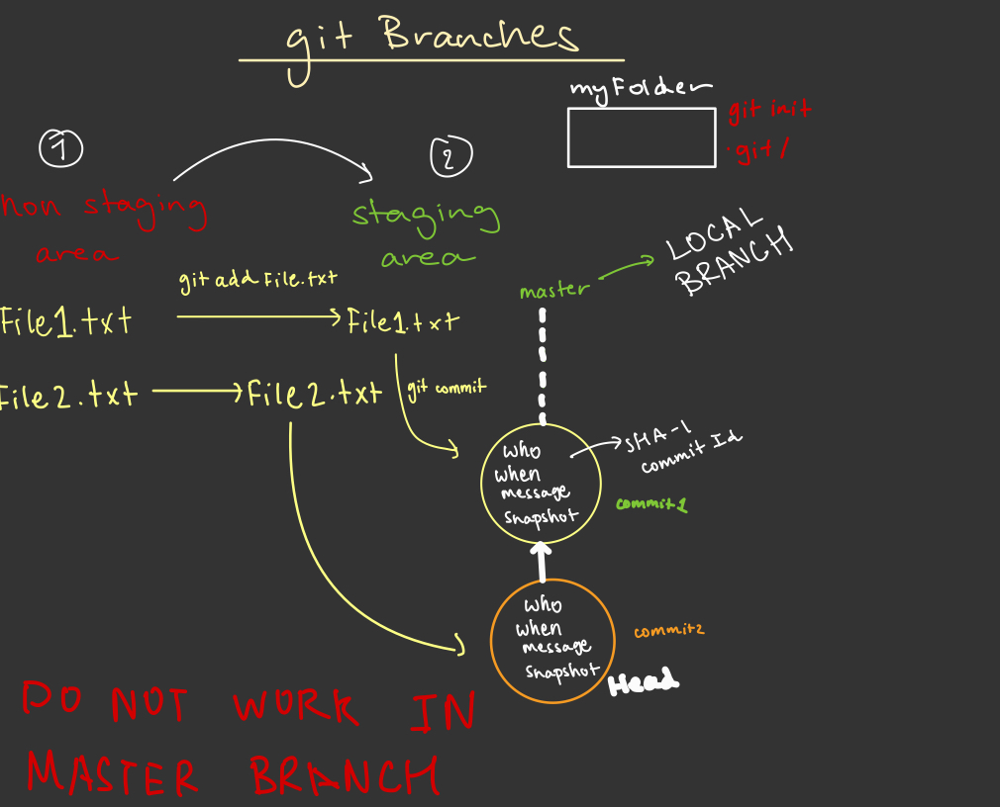
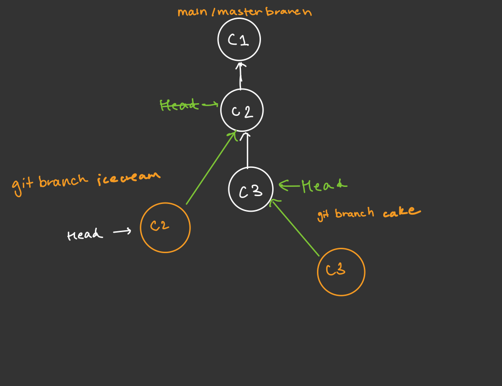
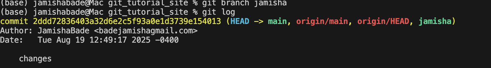

## what are the purpose of branches?

- Branches let you work on new features, fixes, or experiments independently without affecting the main code. They also make collaboration and version management easier by keeping changes organized and separate until ready to merge





- branch icecream and cake are not syncing because they have diff heads.
- branch cake and master are syncing because they have the same head.
- icecream branch is one commit behind master.

## commands

- Check local branches

```bash
# info about LOCAL branches
git branch
```

- Create a branch

```bash
# create a local branch
git branch branchname
```

Notes: both the main and jamisha branch are in the same head. Hence, they are syncing



- change branch

```bash
# create a local branch
git checkout branchname
```
