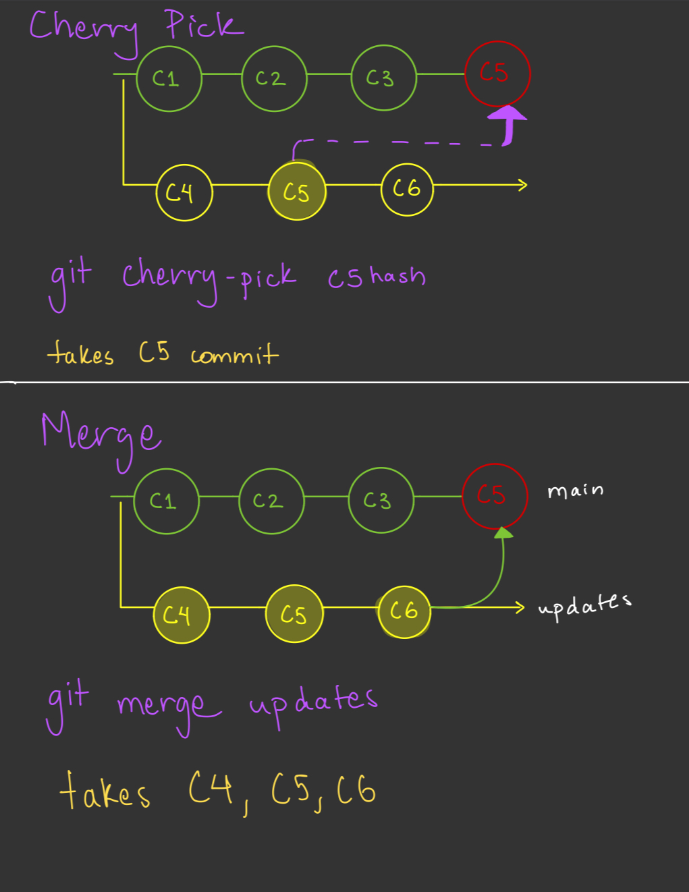

# Git Cherry-Pick (in depth)

## Core Concept

`git cherry-pick` applies the changes from an existing commit to your current branch as a new commit.

## Basic Syntax

```bash
git cherry-pick <commit-hash>
```

## Common Use Cases

Apply a single commit

```bash
git cherry-pick abc1234
```

Apply multiple commits

```bash
git cherry-pick abc1234 def5678
```

Apply a range of commits

```bash
git cherry-pick abc1234..def5678
```

## Advanced Options

Edit commit message before applying

```bash
git cherry-pick -e <commit-hash>
```

Apply changes without committing

```bash
git cherry-pick -n <commit-hash>
```

Sign off on the cherry-picked commit

```bash
git cherry-pick -s <commit-hash>
```

## Handling Conflicts

When conflicts occur:

```bash
# Resolve conflicts manually, then:
git add <resolved-files>
git cherry-pick --continue

# Or abort the operation:
git cherry-pick --abort
```

## Practical Examples

Copy a bug fix from another branch

```bash
git checkout main
git cherry-pick feature-branch~2  # Apply second-to-last commit from feature branch
```

Selective backporting

```bash
git checkout production
git cherry-pick abc1234 def5678  # Apply specific fixes to production
```

## Important Considerations

Commit History Implications

- Cherry-picking creates new commit hashes
- Original commit metadata (author, date) is preserved
- The new commit is unrelated to the original in the commit tree

When to Avoid Cherry-Picking

- Large feature sets (better to merge)
- Commits with complex dependencies
- When you want to preserve commit relationships

## Best Practices

1. **Test after cherry-picking** - Ensure the changes work in the new context
2. **Document why** - Add context in commit messages about why cherry-pick was used
3. **Consider alternatives** - Rebase or merge might be more appropriate

## Difference between cherrypick and Merge

- cherry-pick is copying a specific commit
- merge is integrating an entire branch history



## Performance Notes

- Cherry-picking is generally fast for small changes
- Complex conflicts can significantly slow down the process
- Large commits or binary files may take longer to process

Remember: Cherry-picking is a powerful tool, but it should be used judiciously as it can create duplicate commits and complicate history understanding.
