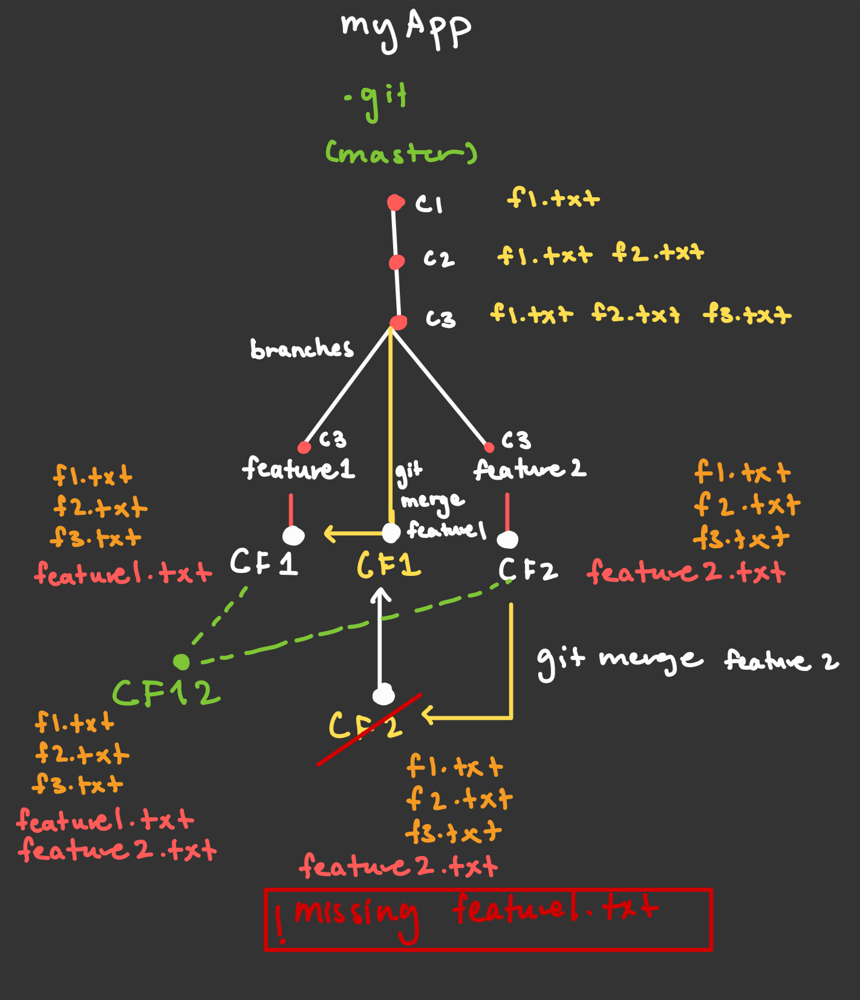

# Git Merge

`git merge` is used to combine changes from one branch into another.

## git merge

```bash
git merge <branch-name>
```

### Example

Suppose you are on `main` and want to merge a feature branch called `feature1`:

```bash
git checkout main      # Make sure you are on the branch you want to merge into
git merge feature1     # Merge changes from feature1 into main
```

- If there are no conflicts, Git will automatically merge the changes.
- If conflicts exist, Git will prompt you to resolve them manually.

---

- Git combines changes from both branches since they split from a common ancestor.

- Any new files in the branch being merged that aren’t in your current branch will be added.

- Any changes to existing files in the merged branch will be applied to your current branch.

- If both branches changed the same part of a file, Git will ask you to resolve a merge conflict.

---

# git scenario



Explanation:
The master branch is split into two branches at commit 3: feature1 and feature2.

- feature1 adds a new commit, F1.

- feature2 adds a new commit, F2.

At this point, the branches have diverged and are not in sync.

When we merge master with feature1, both master and feature1 point to F1, so they are now in sync.

If we then try to merge master with feature2, Git detects a conflict because feature1’s changes are not in feature2.

To resolve this, Git creates a new merge commit that combines the changes from both feature1 and feature2, ensuring that all files from both branches are preserved.
